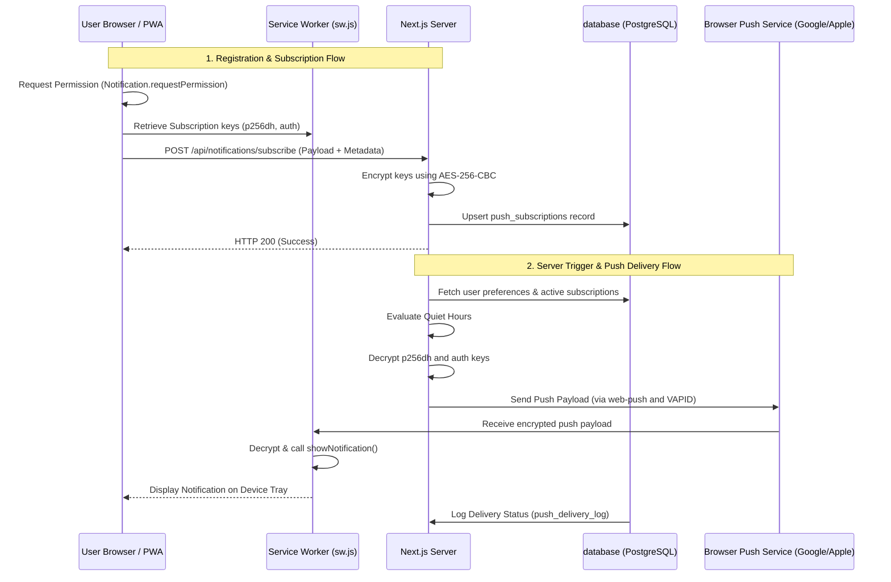

# Notifications Architecture Guide

This document describes how the real-time notification system is designed, stored, and delivered across the application. It covers client subscriptions, cryptographic key encryption, server dispatch logic, service worker processing, and the events that trigger alerts.

---

## 1. High-Level Architecture Overview

The system uses standard **W3C Web Push Protocol** to send notifications directly to users' device trays (even when the browser is closed or in the background). 

### Core Technologies
1. **`web-push`**: Server library used to format, sign (using VAPID), and dispatch payloads to vendor push services (APNs for Apple, FCM for Google/Chrome, Mozilla Push Service for Firefox).
2. **VAPID Keys**: Cryptographic keypair (`NEXT_PUBLIC_VAPID_PUBLIC_KEY` & `VAPID_PRIVATE_KEY`) validating that push dispatches originate from our server.
3. **Database Fallback**: In-app notifications stored in the `notifications_inbox` table as a historical list or fallback when push delivery is impossible.
4. **Service Worker (`public/sw.js`)**: Background script running in the user's browser, responsible for receiving push events and rendering them on the device tray.

---

## 2. Database Models

The notification system relies on three database tables in [prisma/schema.prisma](file:///c:/Users/shams/OneDrive/Documents/GitHub/TFC/prisma/schema.prisma):

### `push_subscriptions`
Stores active devices registered for Web Push. Cryptographic credentials are encrypted before database insertion to protect user security.
- **`endpoint`** `(String)`: Unique URL pointing to the user's browser push service.
- **`p256dhEnc`** `(String)`: Client-side public key encrypted using `AES-256-CBC`.
- **`authEnc`** `(String)`: Shared secret key encrypted using `AES-256-CBC`.
- **`isActive`** `(Boolean)`: Indicates whether the subscription is active. Automatically set to `false` (410 GoAway) if the user revokes permissions or uninstall the PWA.

### `notifications_inbox`
Stores in-app alert history. Used for the client notifications inbox page ([app/(team)/team/notifications/page.tsx](file:///c:/Users/shams/OneDrive/Documents/GitHub/TFC/app/(team)/team/notifications/page.tsx)).
- **`userId`** `(String)`: Recipient user.
- **`title` / `body`** `(String)`: Text content.
- **`category`** `(String)`: Notification type (`auctionWins`, `outbids`, `trades`, `general`).
- **`url`** `(String?)`: Optional redirection route when clicked (e.g. `/team/matches/[id]`).
- **`isRead`** `(Boolean)`: Read status toggle.

### `push_delivery_log`
Provides debugging and observability logs for push deliveries.
- **`subscriptionId`** `(String)`: The targeted device subscription ID.
- **`status`** `(String)`: The outcome state (`SUCCESS`, `FAILED`, `410_EXPIRED`, `429_RATE_LIMIT`, `CLICKED`).
- **`errorMessage`** `(String?)`: Details on network/service failure if `status` is not `SUCCESS`.

---

## 3. Server-Side Execution (`lib/notifications-server.ts`)

All push dispatches go through `sendPushNotificationRaw` in [lib/notifications-server.ts](file:///c:/Users/shams/OneDrive/Documents/GitHub/TFC/lib/notifications-server.ts).

### Step-by-Step Flow:
1. **Validation**: The payload is parsed using a `zod` schema to sanitize HTML tags and enforce length constraints.
2. **VAPID Check**: If VAPID keys are missing, it silently writes to `notifications_inbox` as a fallback and returns.
3. **Preferences & Quiet Hours Evaluation**:
   - Checks the recipient's preference category (`auctionWins`, `outbids`, `trades`, `general`).
   - If the current time falls inside the user's designated `quietHoursStart` and `quietHoursEnd` (parsed as minutes from midnight, handling overnight spans like `23:00` to `07:00`), the push is skipped and written to `notifications_inbox` instead.
4. **Key Decryption**: Active subscription keys are fetched and decrypted using `decrypt` from [lib/crypto-server.ts](file:///c:/Users/shams/OneDrive/Documents/GitHub/TFC/lib/crypto-server.ts) (AES-256-CBC).
5. **Dispatching**:
   - Invokes `webpush.sendNotification(subscription, payload)`.
   - On **410 Gone / 404 Not Found** errors: Automatically updates the subscription's `isActive` flag to `false`.
   - On **429 Rate Limit** errors: Logs rate-limiting status.
6. **Observability Logging**: Inserts execution results into `push_delivery_log`.
7. **Inbox Fallback**: If the user has no active devices or push delivery fails on all targets, the system writes a copy to the `notifications_inbox` table so they still receive the alert when they next open the application.

---

## 4. Client-Side Subscriptions & Service Worker

### Subscription Component (`components/notifications/PushToggle.tsx`)
Located at [components/notifications/PushToggle.tsx](file:///components/notifications/PushToggle.tsx), this handles UI states and browser handshakes:
- **iOS Standalone Requirement**: iOS requires PWAs to be installed (using **Add to Home Screen**) before unlocking the Web Push API. The component displays an instructions panel for iOS users if they are not in standalone mode.
- **Service Worker Subscription**:
  - Checks browser support for `serviceWorker` and `PushManager`.
  - Prompts permission via `Notification.requestPermission()`.
  - Generates the endpoint and encryption keys using `registration.pushManager.subscribe`.
  - Submits registration via `POST /api/notifications/subscribe` along with metadata (`deviceName` and `deviceType`).

### Service Worker (`public/sw.js`)
Located at [public/sw.js](file:///public/sw.js), it handles push delivery in the background:
- **`push` Listener**:
  - Parses the raw JSON payload.
  - Configures vibration pattern, icons, badges, and targets.
  - Renders the system notification using `self.registration.showNotification()`.
- **`notificationclick` Listener**:
  - Closes the notification card.
  - Searches open browser windows. If a matching URL tab is open, it focuses that tab. Otherwise, opens a new window.
  - Links target URL with the redirect routing handler `/api/notifications/click` to capture CTR (Click-Through-Rate) and write clicked states back to `push_delivery_log`.

---

## 5. Event Trigger Points in the Application

Below are the triggers in the application codebase that generate notifications:

| Target Event / Action | Category | Trigger File | Description |
| :--- | :--- | :--- | :--- |
| **New Swap Request** | `trades` | [app/api/team/swap-requests/route.ts](file:///app/api/team/swap-requests/route.ts) | Alerts the receiving manager when a trade proposal is submitted. |
| **Swap Request Approved** | `trades` | [app/api/admin/swap-requests/[id]/approve/route.ts](file:///app/api/admin/swap-requests/[id]/approve/route.ts) | Alerts the proposing and target manager that the swap has completed. |
| **Swap Request Rejected** | `trades` | [app/api/admin/swap-requests/[id]/reject/route.ts](file:///app/api/admin/swap-requests/[id]/reject/route.ts) | Alerts the proposing manager that the swap request was rejected. |
| **Release Request Approved** | `general` | [app/api/admin/release-requests/[id]/approve/route.ts](file:///app/api/admin/release-requests/[id]/approve/route.ts) | Notifies the manager that their player release has been finalized. |
| **Release Request Rejected** | `general` | [app/api/admin/release-requests/[id]/reject/route.ts](file:///app/api/admin/release-requests/[id]/reject/route.ts) | Notifies the manager that their player release request was declined. |
| **Auction Round Start** | `general` | [app/api/admin/rounds/[id]/start/route.ts](file:///app/api/admin/rounds/[id]/start/route.ts) | Alerts team managers that bidding is open for a round. |
| **Auction Round Results Made Public** | `general` | [app/api/admin/rounds/[id]/make-public/route.ts](file:///app/api/admin/rounds/[id]/make-public/route.ts) | Alerts managers when bidding results are visible. |
| **Round Finalization (Bid Wins/Losses)** | `auctionWins` / `outbids` | [app/api/admin/rounds/[id]/finalize/route.ts](file:///app/api/admin/rounds/[id]/finalize/route.ts) | Distributes individual alerts for players successfully signed or outbid. |
| **Tiebreaker Started** | `general` | [app/api/admin/bulk-tiebreakers/[id]/start/route.ts](file:///app/api/admin/bulk-tiebreakers/[id]/start/route.ts) | Alerts all tied managers that sealed bidding is open for resolving ties. |
| **Tiebreaker Resolved** | `auctionWins` / `outbids` | [app/api/admin/bulk-tiebreakers/[id]/resolve/route.ts](file:///app/api/admin/bulk-tiebreakers/[id]/resolve/route.ts) | Notifies tied managers whether they won or lost the tiebreaker player. |
| **Match Submitted / Finished** | `general` | [app/api/seasons/[seasonId]/tournaments/[tournamentId]/matches/[matchId]/route.ts](file:///app/api/seasons/[seasonId]/tournaments/[tournamentId]/matches/[matchId]/route.ts) | Sends match summary notifications to both home and away managers. |
| **Calendar Item Revealed** | `general` | [app/api/seasons/[seasonId]/calendar/[calendarId]/reveal/route.ts](file:///app/api/seasons/[seasonId]/calendar/[calendarId]/reveal/route.ts) | Alerts users when matchdays or calendar events are made public. |
| **Knockout Stage Start / Stop** | `general` | `app/api/seasons/[seasonId]/tournaments/[tournamentId]/rounds/start/route.ts` | Alerts managers when knockout rounds are opened/closed. |
| **Manual Super-Admin Testing** | `general` | [app/api/admin/notifications/test/route.ts](file:///app/api/admin/notifications/test/route.ts) | Allows administrators to broadcast custom message trays. |
